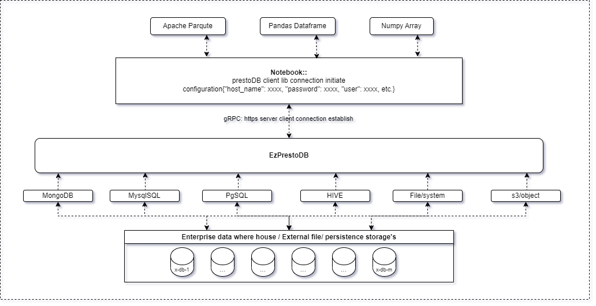
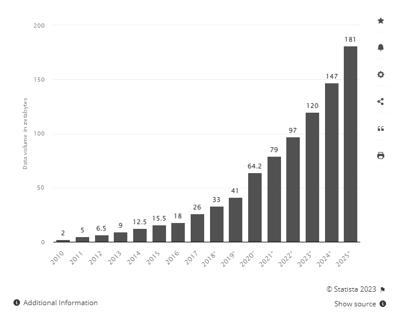
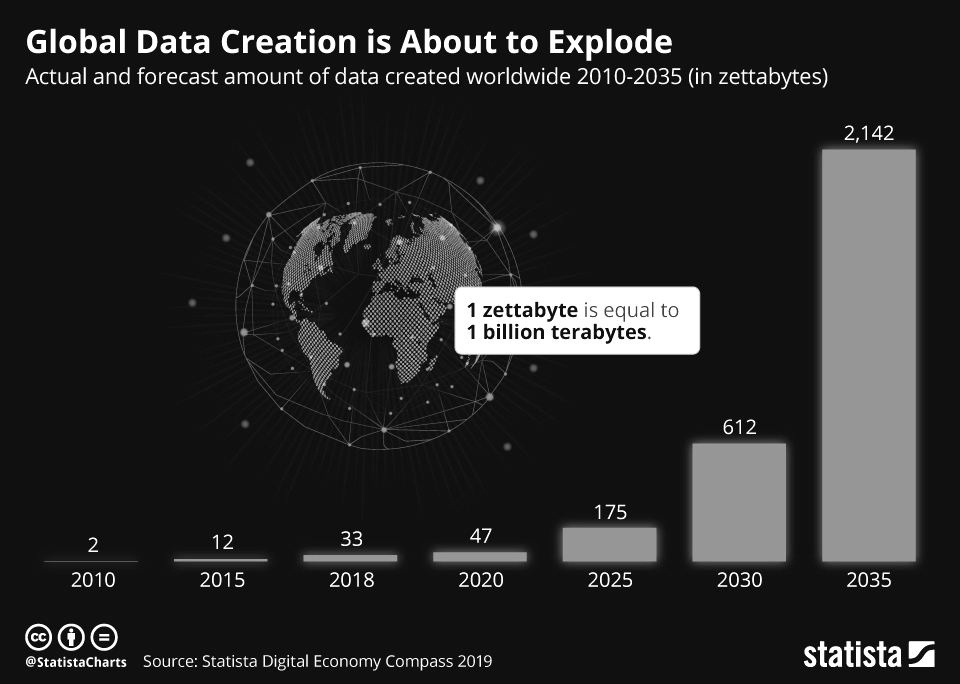

## EzPresto + Notebook client connection: 

# What is PrestoDB (EzPrestoDB):
The Presto (including PrestoDB, and PrestoSQL which was re-branded to Trino) is a distributed query engine for big data using the SQL query language. Its architecture allows users to query data sources such as Hadoop, Cassandra, Kafka, AWS S3, Alluxio, MySQL, MongoDB and Teradata, and allows use of multiple data sources within a query. Presto is community-driven open-source software released under the Apache License.

# The data exists globally: 
The total amount of data created, captured, copied, and consumed globally was 33 zettabytes in 2018-1. This grew to 64.2 zettabytes in 2020 and is projected to grow to more than 180 zettabytes by 2025-21. Post covid everything moved online to a much greater degree: school, work, and, surprisingly everything. 

Although some degree of online fraud and malfunctioning, failure logs, etc. System automation, AI and MLOps etc generating data to data, People continue to spend more time alone than ever before, and that time alone more data produced.

source: Reference taken from @statista

# According to Statista’s Global Economic data repot :: 
The total amount of data created, captured, copied, and consumed globally is forecast to increase rapidly, reaching 64.2 zettabytes in 2020. Over the next five years up to 2025, global data creation is projected to grow to more than 180 zettabytes. In 2020, the amount of data created and replicated reached a new high. The growth was higher than previously expected caused by the increased demand due to the COVID-19 pandemic, as more people worked and learned from home and used home entertainment options more often.

Today, I'have excited to announce how the EzAF offering the robust and resilient ecosystem, completely integrated PrestoDB framework, so any organization or developers can develop LLMs, LLMOps, AI and ML models in-house, using there own governance and secure data without moving to cloud or malfunctioning.

This example code Precisely explains how you can connect your database into EzAF then after how you can connect to Notebook for other experiment purpose.

In this kernel example will give you precise information, how easly you can leverage the integrated tool and services.

## Simple instructions to run experiment.

To complete the tutorial follow simple steps below:

1. Login to you EzAF cluster.
2. Create a new notebook server using the `jupyter-data-science` image.
3. Clone the repository locally.
4. Launch the python file name `EzSQLDBComponent.py` on top of notebook.

## Reference:
1. https://www.statista.com/statistics/871513/worldwide-data-created/
2. https://www.statista.com/chart/17723/the-data-created-last-year-is-equal-to/
3. https://www.statista.com/chart/17727/global-data-creation-forecasts/
4. https://theconversation.com/the-worlds-data-explained-how-much-were-producing-and-where-its-all-stored-159964
5. https://www.journaldunet.com/ebusiness/crm-marketing/1515349-le-big-data-ne-peut-pas-etre-un-defi-dans-le-monde-d-aujourd-hui/
