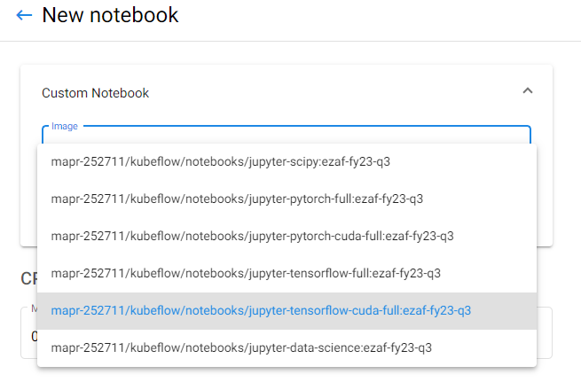
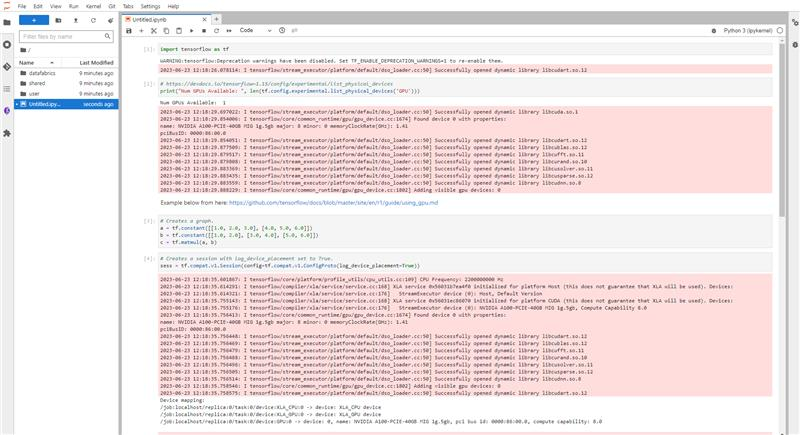
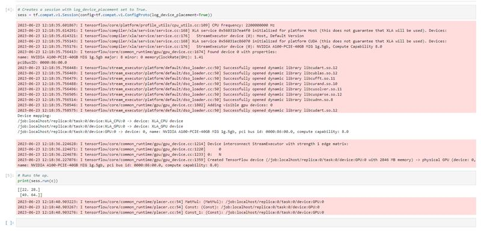
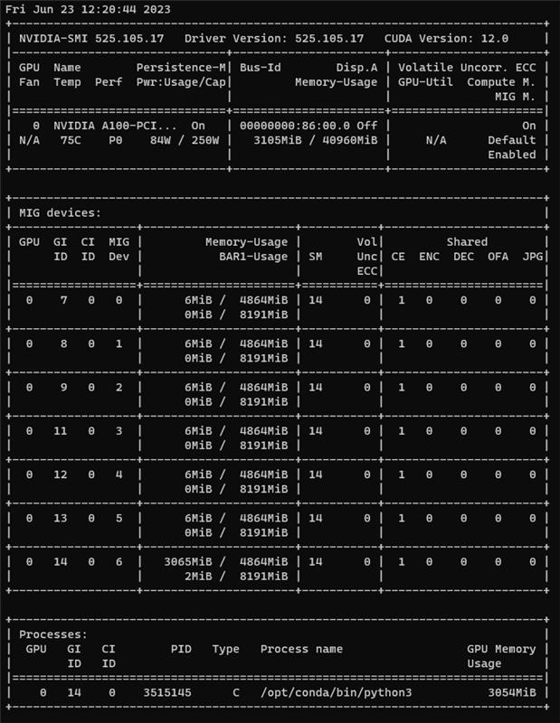
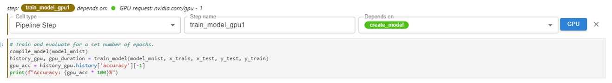
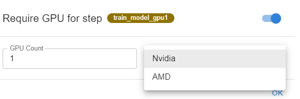

# Running kubeflow-on-gpu example

## Running Kubeflow Notebooks on GPU

In order to create Kubfeflow notebook with GPU, choose corresponding image with CUDA support. During notebook server
creation, click on "Custom Notebook" button within selected "Jupyter" section, and choose one of the following images
in drop-down from the following list:

* `gcr.io/mapr-252711/kubeflow/notebooks/jupyter-tensorflow-cuda-full` (Tensorflow CUDA image)
* `gcr.io/mapr-252711/kubeflow/notebooks/jupyter-pytorch-cuda-full` (PyTorch CUDA image)



Also set number of GPUs to 1 in "GPU" section and select "Nvidia" in "GPU Vendor" drop-down:


### Checking GPU availability in Kubeflow Notebook with requested GPU resources

Open `Check_gpu_card.ipynb` notebook and run all cells in order to check GPU availability in Kubeflow Notebook with
Tensorflow CUDA image. If GPU is available, the following output will be displayed:





Also for verification purposes, `nvidia-smi` command can be executed in pod of daemonset
`nvidia-device-plugin-daemonset` in `hpecp-gpu-operator` namespace. If python3 process is shown as in the following
image, then GPU is working properly within Kubeflow Notebook:



## Running Kubeflow Pipelines and Katib experiments on GPU via Kale extension

It is possible to specify GPU resources for separate pipeline steps via Kale extension. In order to do that, edit
pipeline step (by clicking on "pencil" icon in top right corner of the cell) and click on "GPU" button. Then switch
toggle in the modal window, specify number of GPUs (it should be 1) and Nvidia for GPU vendor in the corresponding
fields and save changes by clicking "OK" button:





After saving changes, GPU resources will be added to the pipeline step and it will be possible to run pipeline with
GPU resources.

### Training MNIST model with Tensorflow on GPU via Kale extension

Open `Train_mnist_kfp_gpu.ipynb` notebook in order to train MNIST model with Tensorflow on GPU via Kale. Run all cells
in notebook just to check that it works properly. Then open Kale extension by clicking on "Kale" button on left panel
and click on "Compile and Run" button at the bottom of the extension window. Proceed to detailed view of pipeline run
by clicking on "View" link. After pipeline run is finished, open "Logs" tab at the "Eval timing" step and check that
duration of GPU training is less than duration of CPU training:

```text
======= Timing =======
CPU time: 367.7431707382202 sec
GPU time: 29.72864580154419 sec
```

Check logs of "Train model cpu" and "Train model gpu1" steps in order to see accuracy of each trained model.

The trained MNIST model is exported to `/mnt/user/mnist-gpu-test` directory in the notebook server pod.

## Running InferenceService on GPU for trained model

In order to run inference service on GPU for trained model, create `InferenceService` resource and specify in resources
section `nvidia.com/gpu: 1` as limits. For example:

```yaml
apiVersion: "serving.kserve.io/v1beta1"
kind: "InferenceService"
metadata:
  name: "tensorflow-gpu"
  namespace: "<username>"
spec:
  predictor:
    serviceAccountName: <service-account-name>
    tensorflow:
      storageUri: "<path-to-model>"
      resources:
        limits:
          nvidia.com/gpu: 1
```

### Deploying InferenceService on GPU for trained MNIST model

Open `Train_and_infer_mnist.ipynb` notebook in order to train MNIST model with Tensorflow on GPU and deploy
InferenceService on GPU for trained model. Run all cells in notebook just to check that it works properly. In the last
cell of the notebook there should be a test images with predicted labels - it means that InferenceService is working
properly on GPU.
