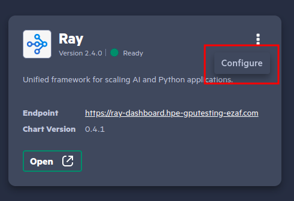
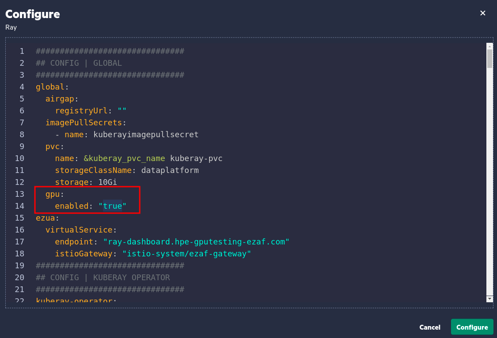
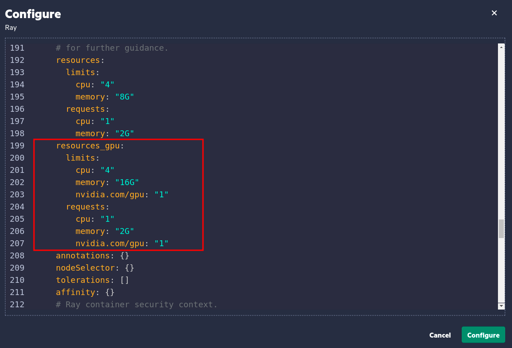

## Running ray-on-gpu example
###### This example shows how to configure a Ray Cluster to allocate and utilize GPU
* If GPU support is not enabled yet in Ray, then go to Ray configuration in `Application & Frameworks -> Data Science -> Ray -> Configure`


* Change the `gpu.enabled` flag to `true`


* (Optional) Adjust the resources in `resources_gpu`


* Then execute Ray GPU-accelerated sample job `ray_gpu_sample.py` either in a notebook or you can shell in Ray's head pod and submit the job

* You can validate the job utilizes GPU by mean of its info logs
```shell
(gpu_operation pid=2277) 2023-06-29 09:25:20.322320: I tensorflow/core/common_runtime/gpu/gpu_device.cc:1635] Created device /job:localhost/replica:0/task:0/device:GPU:0 with 3026 MB memory:  -> device: 0, name: NVIDIA A100-PCIE-40GB MIG 1g.5gb, pci bus id: 0000:86:00.0, compute capability: 8.0
```
or in GPU utilities
```shell
> chroot /run/nvidia/driver nvidia-smi
...
+-----------------------------------------------------------------------------+
| Processes:                                                                  |
|  GPU   GI   CI        PID   Type   Process name                  GPU Memory |
|        ID   ID                                                   Usage      |
|=============================================================================|
|    0    7    0    1140135      C   /opt/conda/bin/python3           3588MiB |
|    0    8    0    2653549      C   ...n/tensorflow_model_server     3588MiB |
|    0   14    0     230876      C   ray::gpu_operation                 10MiB |
+-----------------------------------------------------------------------------+
```
