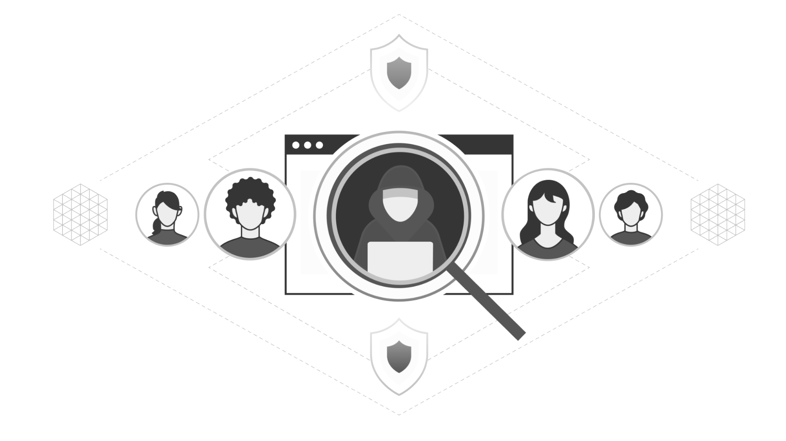

## RAY experiment fraud detection on banking system

# Fraud Detection

The world changed when the COVID-19 pandemic began. Everything moved online to a much greater degree: school, work, and, surprisingly, fraud. Although some degree of online fraud has existed for decades, the Federal Trade Commission reported consumers lost almost $8.8 billion in fraud in 2022 (an over 400% traffic increase since 2019) and the continuation of a disturbing trend. People continue to spend more time alone than ever before, and that time alone makes them not just more targeted, but also more vulnerable to fraud. Companies are falling victim to these trends just as much as individuals: according to PWC’s Global Economic Crime and Fraud Survey, more than half of companies with at least $10 billion in revenue experienced some sort of digital fraud. 

Today, I'have excited to announce how the EzAF offering the robust and resilient ecosystem, completely integrated Ray framework, so any organization or developers can develop LLMs, LLMOps, AI and ML models in-house, As I have implemented here the kernel example Fraud Detection model using EzAF. 

In this kernel example Fraud Detection will give you precise information, how easy the tools integrated, that can help to develop robust models.

## Please follow the steps to run this experiment on you environment

## Follow the guidelines to understand kernel experiment:

1. Login to you EzAF cluster.
2. Create a new notebook server using the `jupyter-data-science` image, initialize Jupiter notebook service.
3. Import all required packages, user define functions, initialize global objects.
4. Procure dataset from object storage, once the dataset loaded successfully
5. Data we need to pre-process, validating, once all the above actions are done here, we are defining the required variables.
6. Once the global variables we are available, we are initiating the model training, at the and based on the best satisfactory score. 
    1. In this experiment gloabl values you can find 3 areas
    2. RayFraudDetectionExperiment (Ray actor details)
    3. configuration_dtl (experiment required configuration declared)
    4. config_data (Kaycloak Authentication and Authorization) 
7. Please find the./secret folder, run the below command it will create a secret, access object store.
    1. command: kubectl apply -f fraud-detection-create-s3-secret.yaml
8. Based on the satisfactory score we are deploying the model with KServe on top kubernetes cluster.
9. The detail documentation and unit end experiment snips are updated./assets
10. Reference and Conclusion I have updated the real-world statistics and survey details, have a look.

## Simple instructions to run experiment.

To complete the tutorial follow simple steps below:

1. Login to you EzAF cluster.
2. Create a new notebook server using the `jupyter-data-science` image.
3. Clone the repository locally.
4. Launch the `ray_acceleration_experiment_fraud_detecting_on_banking_system.ipynb` notebook file.

NOTE: If the runtime_env={"pip" : ["minio", "imblearn"] causing trouble to run the experiment.
Please following the below steps:

[A] with proxy:
1. Open the Ray head, worker node pod termainal run the following commands 
    1. pip install minio
    2. pip install imblearn
2. please close the pod terminal, go back to your notebook and run the experiment it will work as expected. 

[B] with out proxy:
1. Open the Ray head, worker node pod termainal run the following commands 
    1. export http_proxy="http://10.78.90.46:80" && export https_proxy="http://10.78.90.46:80" && export HTTP_PROXY ="http://10.78.90.46:80"  && export HTTPS_PROXY ="http://10.78.90.46:80" 
    2. pip install minio
    3. pip install imblearn
2. please close the pod terminal, go back to your notebook and run the experiment it will work as expected.