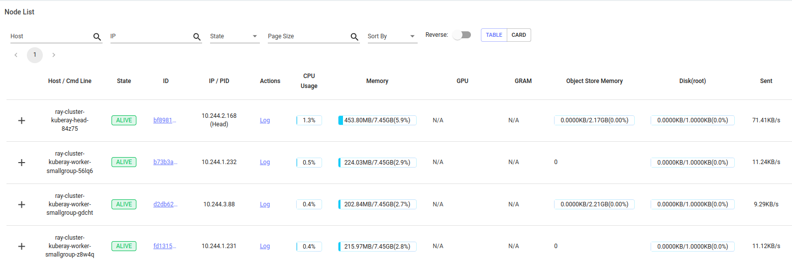
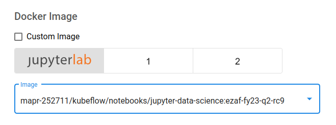

## Default Deployment:
By default, auto-scaling mode is enabled in Ray deployment. So, Ray cluster will be automatically scaled up and down based on resource demand.

When there is no workload, Ray cluster has a head and a worker node as below;
```agsl
kubectl -n kuberay get pod
NAME                                          READY   STATUS    RESTARTS   AGE
kuberay-operator-6c75647d8b-7mpqp             1/1     Running   0          22h
ray-cluster-kuberay-head-gw8lc                2/2     Running   0          22h
ray-cluster-kuberay-worker-smallgroup-vgswq   1/1     Running   0          22h
```
Please note that one of the containers in head pod is autoscaler which is responsible for adjusting the number of Ray nodes in a Ray cluster.

When a submitted-job demands more resources than cluster's current resources, then autoscaler will create more pods as below;

If a pod -which is created by autoscaler- stays idle for 60s, then autoscaler will destroy it.
## Prerequisites:
* While creating notebook for Ray, please choose `mapr-252711/kubeflow/notebooks/jupyter-data-science:<tag>` image. The image has compatible python version and necessary modules.

* If you submit Ray jobs from out of EzAF env, Ray binaries can be installed through pip to where the jobs are submitted from;
```
pip install ray==<version>
```
Note: For the `fy23-q2` release, the version for Ray is `2.2.0`;
```agsl
pip install ray==2.2.0
```
* If you submit Ray jobs from out of EzAF env, please make sure that python versions on client and server side match. Otherwise, you may hit an issue similar to below;
```agsl
RuntimeError: Python minor versions differ between client and server: client is 3.10.6, server is 3.8.13
```
Note: For the `fy23-q2` release, Ray image has python version `3.8.X`.

## Fibonacci Example:
### Turning Python Functions into Remote Functions (Ray Tasks):
Submitting Ray jobs can be done by decorating a normal Python function with `@ray.remote`. This creates a task which can be scheduled across your laptop's CPU cores (or Ray cluster).

Consider the two functions below which generate Fibonacci sequences (integer sequence characterized by the fact that every number after the first two is the sum of the two preceding ones). The first is a normal python function and the second is a Ray task.
```agsl
import os
import time
import ray

# Normal Python
def fibonacci_local(sequence_size):
    fibonacci = []
    for i in range(0, sequence_size):
        if i < 2:
            fibonacci.append(i)
            continue
        fibonacci.append(fibonacci[i-1]+fibonacci[i-2])
    return sequence_size

# Ray task
@ray.remote
def fibonacci_distributed(sequence_size):
    fibonacci = []
    for i in range(0, sequence_size):
        if i < 2:
            fibonacci.append(i)
            continue
        fibonacci.append(fibonacci[i-1]+fibonacci[i-2])
    return sequence_size
```
There are a couple of things to note regarding these two functions. First, they are identical except for the `@ray.remote` decorator on the `fibonacci_distributed` function.

The second thing to note is the small return value. They are not returning the Fibonacci sequences themselves, but the sequence size, which is an integer.

### Comparing Local vs Remote Performance:

The functions in this section will allow us to compare how long it takes to generate multiple long Fibonacci sequences both locally and in parallel. It is important to note that both functions below utilize `os.cpu_count()` which returns the number of CPUs in the system.
```agsl
# Normal Python
def run_local(sequence_size):
    start_time = time.time()
    results = [fibonacci_local(sequence_size) for _ in range(os.cpu_count())]
    duration = time.time() - start_time
    print('Sequence size: {}, Local execution time: {}'.format(sequence_size, duration))

# Ray
def run_remote(sequence_size):
    # Starting Ray
    start_time = time.time()
    results = ray.get([fibonacci_distributed.remote(sequence_size) for _ in range(os.cpu_count())])
    duration = time.time() - start_time
    print('Sequence size: {}, Remote execution time: {}'.format(sequence_size, duration))
```
Now we can run both of these functions to compare the performances under different loads.
```agsl
ray.init(address="ray://ray-cluster-kuberay-head-svc.kuberay:10001")
print('Comparison of sequence size of 10000. In lower sequence, it is expected that local execution will perform better:')
run_local(10000)
run_remote(10000)
print('Comparison of sequence size of 100000. In higher sequence, it is expected that Ray execution will perform better:')
run_local(100000)
run_remote(100000)
ray.shutdown()
```
Finally, it is important to note that when the process calling `ray.init()` terminates, the Ray runtime will also terminate. In order to close the connection, you can add below line;
```agsl
# To explicitly stop or restart Ray, use the shutdown API
ray.shutdown()
```

The complete example can be found in `demo-samples/kuberay/fibonacci_example.py`
## News Recommendation System Example:
The goal of this example is to train a very simple news recommendation system, We will:

* Prepare the training data in parallel with Ray,
* Train a simple model that classifies article titles as "popular" or "less popular" using scikit learn and,
* Find good hyperparameter settings for the model with Tune, Ray's parallel hyperparameter optimization library.

Please upload `demo-samples/kuberay/news_recommendation.ipynb` to a notebook to examine the example more detailed.

## Ray Dashboard:
Ray comes with a dashboard that is available at `https://ray-dashboard.<domain_name>/`

The dashboard lets you;
* Understand Ray memory utilization and debug memory errors. 
* See per-actor resource usage, executed tasks, logs, and more. 
* View cluster metrics. 
* Kill actors and profile your Ray jobs. 
* See errors and exceptions at a glance. 
* View logs across many machines in a single pane. 
* See Ray Tune jobs and trial information.
