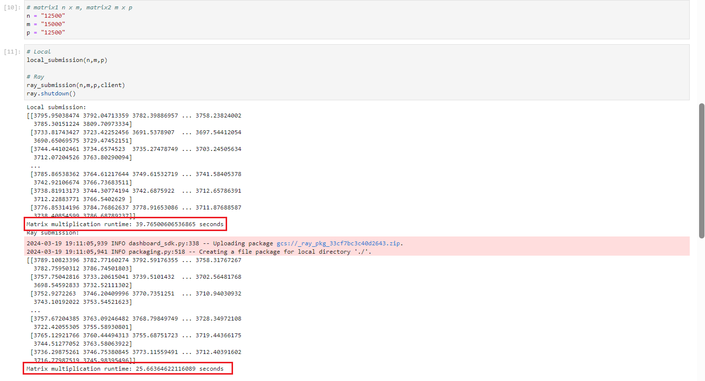

## Ray Matrix_Multiplication Example

##### This example demonstrates the comparison between executing tasks locally and distributedly using Ray.

### Prerequisites:
* Ensure you are using a Data Science notebook environment with aleast 3 CPUs and 4 Gi of memory in Kubeflow. 
* Ray client and server versions must match. Typically, `ray --version` can be used to verify the installed version. 
* Activate the Ray-specific Python kernel in your notebook environment. 
* To ensure optimal performance, use dedicated directories containing only the essential files needed for that job submission as a working directory.

### Turning Python Functions into Remote Functions (Ray Tasks):
To leverage Ray's distributed computing capabilities, regular Python functions can be submitted as Ray tasks using the `JobSubmissionClient`. 

Consider the following function that generates two random matrices 

```python
def matrix_multiplication(n,m,p):
    # Generate random matrices
    matrix1 = np.random.rand(n, m)
    matrix2 = np.random.rand(m, p)

    result_matrix = np.dot(matrix1, matrix2)
    return result_matrix
```
This function can be executed both as a regular Python function and as a Ray job for distributed execution.

### Comparing Local vs Remote Performance:
We compare the duration required to generate two random matrices and multiply them to each other using numpy package, executing the tasks locally and using Ray. 
The objective is to showcase Ray's efficiency under heavy workloads. 

The execution approach is based on system resources as shown below:
```python
if __name__ == "__main__":
    n = int(sys.argv[1])
    m = int(sys.argv[2])
    p = int(sys.argv[3])

    start_time = time.time()
    result = matrix_multiplication(n,m,p)
    end_time = time.time()
    # Calculate runtime
    runtime = end_time - start_time

    print(result)
    print("Matrix multiplication runtime:", runtime, "seconds")
```

Below is a screenshot showing the comparative performance results, illustrating Ray's effectiveness in handling intensive computational tasks:

