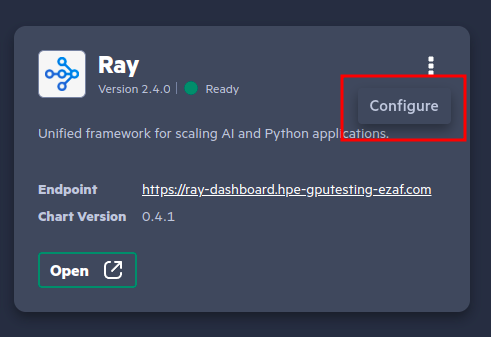
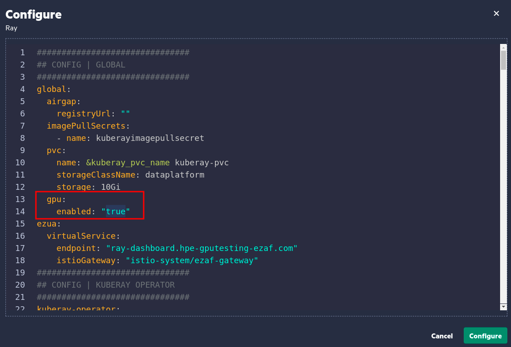
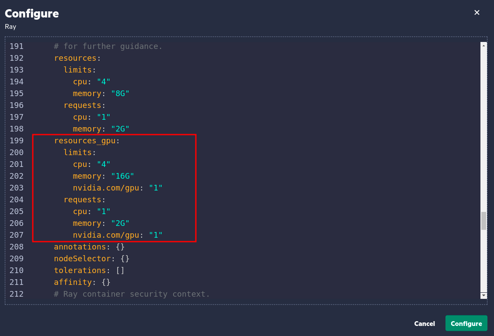

## Ray GPU Example

##### This guide illustrates configuring a Ray Cluster to run GPU-accelerated jobs, enhancing computational performance for suitable tasks.

### Prerequisites:
* Ensure you are using a `tensorflow-full` notebook environment in Kubeflow.
* Ray client and server versions must match. Typically, `ray --version` can be used to verify the installed version.
* Activate the Ray-specific Python kernel in your notebook environment.
* To ensure optimal performance, use dedicated directories containing only the essential files needed for that job submission as a working directory.

### Running GPU accelerated sample job:
To leverage GPU acceleration in Ray, follow these steps:

* Navigate to the Ray configuration via `Application & Frameworks -> Data Science -> Ray -> Configure` as below: 

* Locate and set the `gpu.enabled` flag to `true` to enable GPU support: 

* (Optional) Adjust the resources in `resources_gpu`: 

* With GPU support configured, run a sample GPU-accelerated job provided in the `ray-gpu-executor.ipynb` notebook.

* Monitor the job's logs to confirm GPU engagement. Look for entries indicating GPU device is found:
```shell
Num GPUs Available:  1
TensorFlow will run on GPU.
2024-03-13 13:22:01.258384: I tensorflow/core/common_runtime/gpu/gpu_device.cc:1613] Created device /job:localhost/replica:0/task:0/device:GPU:0 with 38375 MB memory:  -> device: 0, name: NVIDIA A100-PCIE-40GB, pci bus id: 0000:86:00.0, compute capability: 8.0
```

* Alternatively, `ssh` into the GPU node and use `nvidia-smi` to observe GPU processes and memory usage in real-time:
```shell
> chroot /run/nvidia/driver nvidia-smi
...
+-----------------------------------------------------------------------------+
| Processes:                                                                  |
|  GPU   GI   CI        PID   Type   Process name                  GPU Memory |
|        ID   ID                                                   Usage      |
|=============================================================================|
|    0    7    0    1140135      C   /opt/conda/bin/python3           3588MiB |
|    0    8    0    2653549      C   ...n/tensorflow_model_server     3588MiB |
|    0   14    0     230876      C   ray::gpu_operation                 10MiB |
+-----------------------------------------------------------------------------+
```
