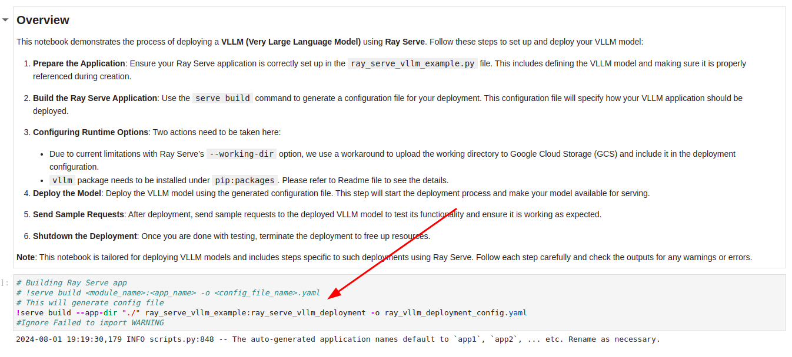
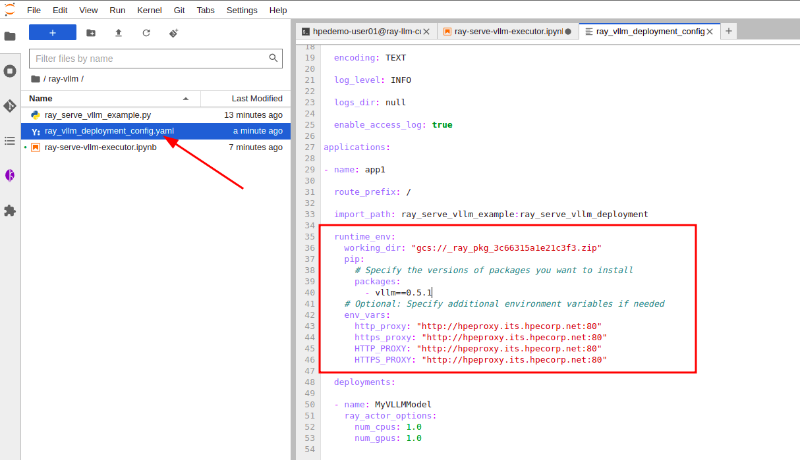
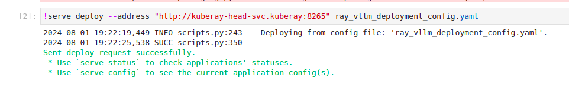
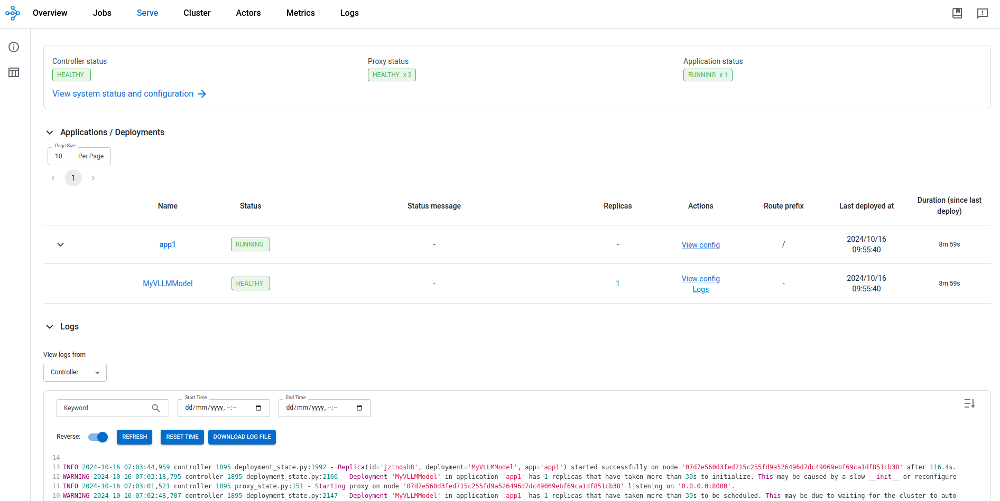
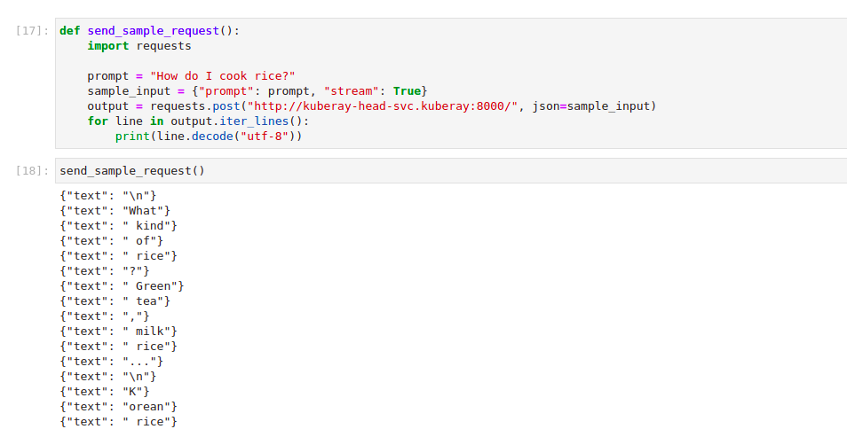
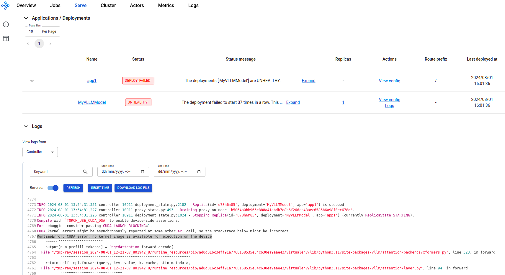

## Ray Serve vLLM Example

##### This guide illustrates configuring Ray to serve a LLM with vLLM.
Please note that there is a Serve deployment config file example under resource directory. you can refer to it when necessary.

### Prerequisites:
* Ensure you have enabled GPU support for Ray (https://github.com/HPEEzmeral/ezua-tutorials/blob/feature/fy24-q3/Data-Science/Ray/Ray-GPU/README.md) as vLLM requiers GPU to run (https://vllm.readthedocs.io/en/latest/getting_started/installation.html)
* Checkout Ray-GPU example from tutorials on how to enable GPU support for Ray
* With GPU support configured, create a `jupyter-tensorflow-cuda-full` notebook environment in Kubeflow.
* Ray client and server versions must match. Typically, `ray --version` can be used to verify the installed version.
* Run below commands from the terminal to install vLLM in the Ray kernel 
    ``` pyton
    conda activate ray
    # Proxies are optional based on your env
    export HTTP_PROXY=<>
    export HTTPS_PROXY=<>
    export https_proxy=<>
    && export http_proxy=<>
    pip install vllm==0.5.1
    ```
* To ensure optimal performance, use dedicated directories containing only the essential files needed for that job submission as a working directory.
* Activate the Ray-specific Python kernel in your notebook environment.
* vLLM may require additional memory and storage, please make sure that cluster's resources are sufficient.
* Once the above prerequisites are fulfilled, follow below the steps:

### Running vLLM with Ray Serve:

* Make sure that both `ray-serve-vllm-executor.ipynb` and `ray_serve_vllm_example.py` are present inside the same dedicated directory.
* `serve build` will generate deployment config file:

  

* Modify the deployment config file after executing the workaround. Please note that you need to specify `working_dir` and `pip` installation as below. (Sample config file is provided under resources.)

  

* Deploy the app after config file is ready:

  

* Check the deployment status in Ray dashboard:

  

* Once the deployment is ready, you can request from the model:

  


### Troubleshooting:
* **Out of Memory Issues:** vLLM requires additional memory, which may cause out-of-memory errors during deployment. To resolve this, increase the memory allocation for the Ray head and worker nodes.
* **Insufficient GPU:** If the GPU is inadequate, you may encounter the following error:
```
RuntimeError: CUDA error: no kernel image is available for execution on the device
```

* **Disk Quota Exceeded:** If storage is insufficient, you may see this error:
```
ERROR: Could not install packages due to an OSError: [Errno 122] Disk quota exceeded
```
* **Outdated vLLM Version:** If using an outdated vLLM version, you might see the following error:
```
error: can't find Rust compiler
```