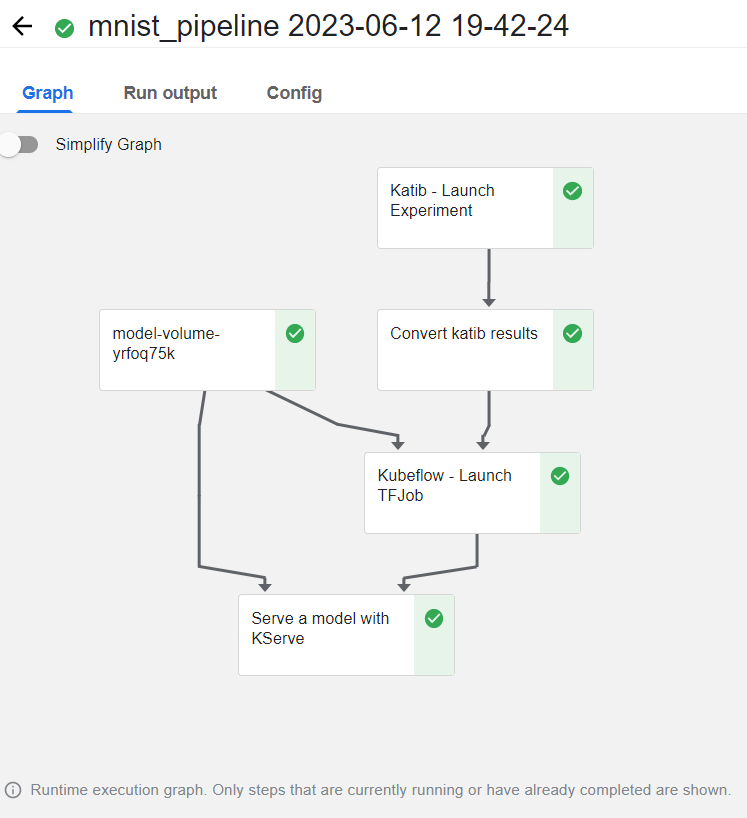

# Getting started

1. Click Configuration Details in the lower-left corner.

2. Copy the connection URL and paste it into a new browser tab. You can drag this tab to another screen to increase efficiency

3. Use the credentials provided in Configuration Details to log in to HPE Ezmeral Unified Analytics Service dashboard.

# Run a DAG in Airflow

In Airflow, The Directed Acyclic Graph (DAG) runs a Spark application that pulls the images from object storage, transforms the data into Parquet format, and writes the transformed Parquet data into the shared volume.

1. Click Applications & Frameworks in the left navigation menu and select the Data Engineering tab.

2. Within the Airflow tile, click Open.

3. A separate browser tab opens, and you are automatically signed into the Airflow dashboard.

4. While in the Airflow dashboard, you'll want to verify you are on the DAGs tab.

5. Click the "spark_read_write_parquet_mnist" url DAG from the list.

6. Click Code to view the DAG code.

7. Click Graph to view the graphical representation of the DAG.

8. Run the DAG by clicking the Play button to select Trigger DAG w/config.

9. In the JSON configuration, update the username parameter with your username:

```
{ 

    "username": "<username>", 

    "training_path": "mnist-spark-data", 

    "s3_secret_name": "spark-s3-creds" 

}
```
    Note: You can find your username by clicking your profile in the top-right corner of the page or within the configuration details button in the bottom-left. You'll need to clear your browser's cache and cookies if you see a different user ID listed.

10. To run a DAG, click Trigger.

11. To track the DAG job status within Airflow, click the Browse tab and select Jobs.

    Note: Track the state of the Job as it's running, it takes approximately 3-5 minutes for the DAG job execution to success, refresh your browser page to see the state changes to success.

Info: Data that Spark processes is saved in the User volume. You can locate your username in Airflow by going to your profile in the top-right corner of the screen. Upon successful DAG completion, the data is accessible inside your notebook server in the following directory for further processing: usr/mnist-spark-data/

# View the Spark application

After you run the DAG, you can view the status of the Spark application in the Spark Applications screen.

1. Switch back the browser tab that has the Unified Analytics dashboard.

2. Click Analytics then Spark Applications from the left navigation menu.

3. In the search box, type "spark-mnist-<username>" and locate the application with your username. You can now see the status of the Spark application.

    Note: It takes approximately 3-5 minutes for the state of the spark application to move to completed.

4. Optionally, you can also view the YAML for it, by clicking the 3 dots to the right, under the Actions column and selecting View YAML.
    
# Connect to notebook

Connect to your Jupyter notebook and perform setup tasks to prepare the environment to train the model. A user folder with a sample notebook file is provided for the purpose of this Test Drive.

To connect your notebook and perform setup tasks:

1. In the HPE Ezmeral Unified Analytics Software browser dashboard, go to Applications & Frameworks.

2. Click the Data Science tab.

3. Within the Kubeflow tile click Open.

4. In Kubeflow dashboard browser tab, click Notebooks to open the notebooks page. For smaller screens, you may need to click on the menu icon in the upper-left corner for this to appear.

5. Click Connect to connect to your notebook server e.g. <username>-notebook

6. Double click the /shared folder on the left-hand side notebook panel.

7. Double click the /demo folder on the left-hand side notebook panel.

8. Double-click on the mnist_katib_tf_kserve_example.ipynb file to open the document in the Launcher.

# Training the model

To train the model:

1. In the notebook Launcher, select the first cell of the notebook and click the play icon.

2. Run all of the cells in sequence.

3. Click the Run details link once you see the following prompt:

    Please monitor the "Runs" tab on the Kubeflow dashboard by clicking on the "Run details" above. Your KFP run may take a few minutes, please come back to see the prediction result. Please wait...

    You can continue to the next step in this Test Drive before this finishes. 
    
# Kubeflow pipelines

Here is another way to access that same pipeline graph.

1. Go back to the the HPE Ezmeral Unified Analytics Software UI browser tab, Data Science and select Kubeflow Pipelines.

2. Go back to the Kubeflow browser tab, click Runs, and select your job name to see that it is running.

3. View the Kubeflow pipeline in the UI and wait for it to successfully complete.

    Note: Before you can track the state of the mnist pipeline workflow, it takes approximately 5-10 minutes for the workflow execution to change it's status to Success.


