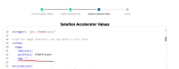

## Testing NVIDIA-NIM Unit Tests with Solution Accelerator

**Prerequisites**

Repository Setup: Know the runtime image path and tag for solution accelarator application on the cluster.

**Steps** 

**Import Tar File:**

1.Open the solution accelerator interface.
2.Click on Add New.
3.Upload the tar file containing the NVIDIA-NIM unit tests.
4.Configure Runtime Image:

In the deployment settings, specify the following:
Runtime Image Path: The path to the runtime image of your solution accelerator on the cluster.
Runtime Image Tag: The tag associated with the runtime image.

**Deploy Application:**

Click the "Deploy" button to start the deployment process.

**Testing**

Verify Deployment:

Ensure the application is deployed successfully and the inference serving is up and running.
Update Inference Service URL in the nvidia_nim_inference_testing_collection, replace the placeholder URL with the actual inference service URL obtained from the deployed application.

Run Tests:

Execute the tests in the collection to evaluate the performance and correctness of the deployed NVIDIA-NIM unit tests.
