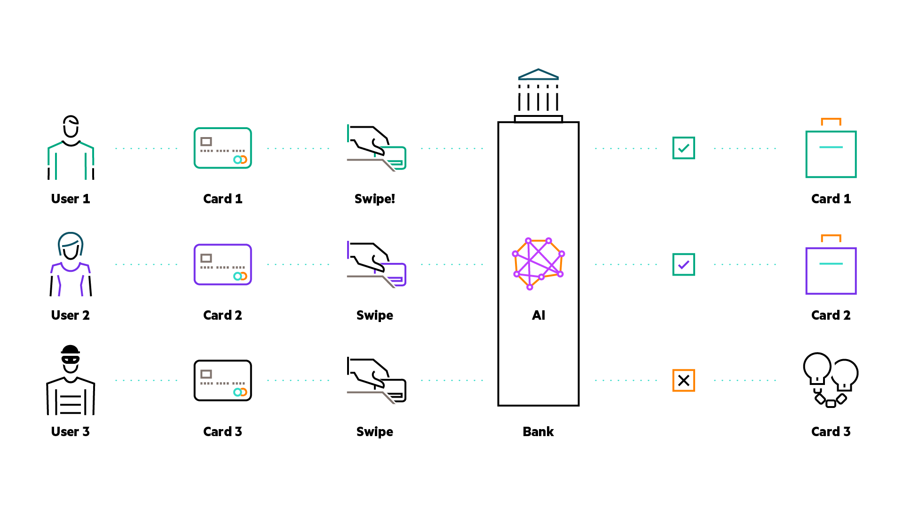

# Fraud Detection (Kubeflow Pipelines - KServe)

In this tutorial, you train several Machine Learning (ML) models to detect fraudulent transactions
using the Banksim dataset[1]. This synthetically created dataset is a combination of various
customer payments, made at different intervals and in varying amounts. Through this, you aim to
create an automated system that can detect and curtail fraudulent activities with high accuracy.

Fraudulent activity has permeated multiple sectors, from e-commerce and healthcare to banking and
payment systems. This illicit industry amasses billions every year and is on an upward trajectory.
The 2018 global economic crime survey by PwC [2] verifies this assertion, revealing that 49 percent
of the 7,200 enterprises surveyed had fallen prey to some form of fraudulent conduct.

Despite the perceived peril of fraud to businesses, the advent of sophisticated systems equips us
with the tools to detect and prevent such behaviors.

1. [What You'll Need](#what-youll-need)
1. [Procedure](#procedure)
1. [How it Works](#how-it-works)
1. [Clean Up](#clean-up)
1. [References](#references)

## What You'll Need

For this tutorial, ensure you have:

- Access to an HPE Ezmeral Unified Analytics (EzUA) cluster.

## Procedure

To complete this tutorial follow the steps below:

1. Login to your EzUA cluster, using your credentials.
1. Create a new notebook server using the `jupyter-data-science` image. Request at least 4Gi of
   memory for the Notebook server.
1. Connect to the Notebook server, launch a new terminal window, and clone the repository locally.
1. Navigate to the tutorial's directory (`ezua-tutorials/demos/fraud-detection`).
1. Launch the `fraud-detection.ipynb` notebook file.
1. Run the the Notebook up to the `Prediction` section.
1. Navigate to the Kubeflow Endpoints UI and make sure that the ISVC is ready to accept requests.
1. Return to the Notebook and run the `Prediction` section of the Notebook to invoke the inference
   service.
1. Use the EzUA "Import Framework" wizard to upload the tarball located inside the `application`
   folder. This creates a user interface for your application. Complete the steps and wait for a new
   endpoint to become ready.
1. Connect to the endpoint and submit your questions.

## How it Works

The Notebook trains and evaluates four different models, and the top-performing model is served
using KServe [3], a renowned tool used for model serving.

Once everything is set up, you have the ability to invoke the resulting ISVC, testing your model's
ability to determine whether a particular transaction is fraudulent or genuine.

## Clean Up

To clean up the resources used during this experiment, follow the steps below:

1. Go to the Kubeflow Endpoints UI and delete the `fraud-detection` ISVC that was generated by the
   pipeline run.
1. Go to the "Import Framework" EzUA UI to delete the application you imported to serve as the
   demo's front end.

## References

1. [Banksim Data Set Paper](http://www.msc-les.org/proceedings/emss/2014/EMSS2014_144.pdf)
1. [Lavion, Didier; et al, "PwC's Global Economic Crime and Fraud Survey 2022"](https://www.pwc.com/gx/en/services/forensics/economic-crime-survey.html)
1. [KServe - Highly scalable and standards based Model Inference Platform on Kubernetes for Trusted AI](https://kserve.github.io/website/0.11/)