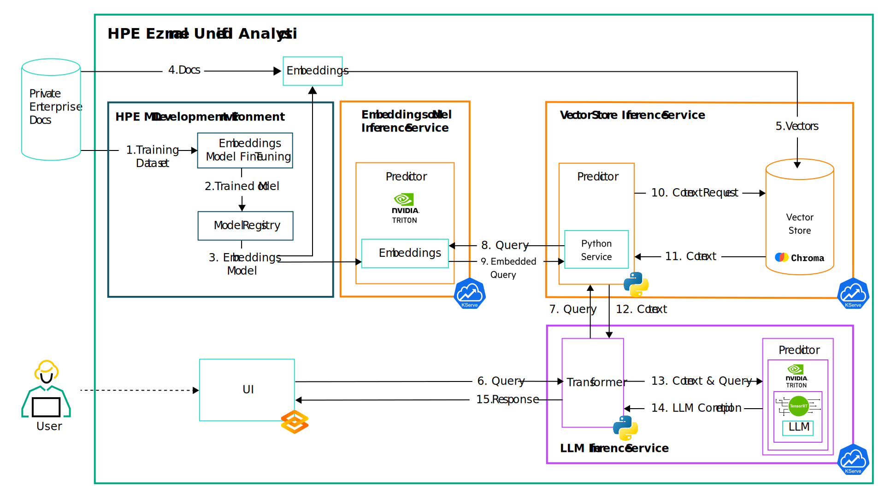

# MLDE Demo (WiP)

In this tutorial, you build a question-answering RAG (Retrieval Augmented Generation) system using
an open source Large Language Model (LLM) and a fine-tuned embeddings model. This system can answer
questions from a corpus of private documentation. In this use case, we are using the Ezmeral
Unified Analytics (EzUA) and the Ezmeral Data Fabric (EzDF) documentation as our dataset.


To make this happen, you:

* Deploy an embeddings model, fine-tuned on a corpus of private documentation.
* Use this model to build and deploy a Vector Store, designed to capture and index the latent
  representation of each document effectively.
* Deploy an LLM to respond to inquiries, leveraging the context extracted from the Vector Store, in
  a natural language format.

1. [What You'll Need](#what-youll-need)
1. [Procedure](#procedure)
1. [Troubleshooting](#troubleshooting)
1. [How It Works](#how-it-works)
1. [Clean Up](#clean-up)
1. [References](#references)

## What You'll Need

For this tutorial, ensure you have:

- Access to an HPE Ezmeral Unified Analytics (EzUA) cluster.
- The fine-tuned [BGE-M3](https://ezmeral-artifacts.s3.us-east-2.amazonaws.com/bge-m3.tar.gz)
  embeddings model this tutorial uses.
- Access to the Llama 2 7B LLM, along with its compiled TensorRT-LLM engines. You can clone the
  [Llama 2 7B](https://huggingface.co/meta-llama/Llama-2-7b-chat-hf) model from Hugging Face and
  download the TensorRT-LLM engines from the [HPE Ezmeral Artifacts](https://ezmeral-artifacts.s3.us-east-2.amazonaws.com/llama-engines.tar.gz).

## Procedure

To complete the tutorial follow the steps below:

1. Login to your EzUA cluster, using your credentials.
1. Create a new Notebook server using the `dpoulopoulos/jupyter:v1.7.0-dirty` image. Request at
   least `8Gi` of memory for the Notebook server, `4` CPUs and `1` GPU device.
1. Connect to the Notebook server, launch a new terminal window, and clone the repository locally.
   See the troubleshooting section if this step fails.
1. Navigate to the tutorial's directory (`ezua-tutorials/demos/question-answering-llama`)
1. Install the required dependencies:
       ```
       pip install -r requirements.txt
       ```
1. Launch the five Notebooks in order and execute the code cells.
1. Use the EzUA "Import Framework" wizard to upload the tarball located inside the `application`
   folder. This creates a user interface for your application. Complete the steps and wait for a new
   endpoint to become ready.
1. Connect to the endpoint and submit your questions.

## Troubleshooting

If you're operating behind a proxy, you'll need to configure several environment variables to
successfully clone the `ezua-tutorials` repository to your local machine, install its dependencies
using `pip`, and download the necessary Machine Learning (ML) models from external sources. 

To clone the repository and install the necessary Python libraries using `pip`, launch a terminal
window and execute the following commands:

- `export http_proxy=<your http proxy URL>`
- `export https_proxy=<your https proxy URL>`

## How It Works

This project taps into a BGE-M3 embeddings model [1] to translate the sentences and paragraphs from
a private document corpus into a multi-dimensional dense vector space [2]. By doing so, you can
employ sophisticated techniques like semantic search, empowering users to pinpoint relevant
details swiftly and precisely. The generated vectors are stored and indexed within a local
[Chroma](https://www.trychroma.com/) instance, a cloud-native, open-source embedding database [3].

Once a question is provided, the application embeds it into the previously mentioned vector space
using the same embedding model. By default, it fetches the four top relevant documents, utilizing a
particular algorithm (most commonly kNN) [4]. Subsequently, the application relays the user's
question along with the retrieved context to an LLM, ensuring the answer mirrors human-like speech.
This tutorial uses the Llama 2 7B model, served with KServe. KServe uses the Triton Inference Server
as its backend which in turn uses the TensorRT-LLM backend, which provides several optimizations,
such as PagedAttention (vLLM) [5], FlashAttention [6], etc.

Now, onto the serving details: Using [KServe](https://kserve.github.io/website/0.11/) [6] you can
set up an Inference Service (ISVC) with custom components. To do this, you need to build and push
two Docker images which KServe will use to serve both the Vector Store and the transformer component
of the LLM ISVC. Below are the application directories containing the respective Dockerfiles
to build these images:

- Vector Store: [`dockerfiles/vectorstore`](dockerfiles/vectorstore)
- LLM Transformer: [`dockerfiles/transformer`](dockerfiles/transformer)

> For your convenience, you can use the pre-built images we have prepared for you:
> - Vector Store: `dpoulopoulos/qna-vectorstore-mlde:v0.1.0`
> - LLM Transformer: `dpoulopoulos/qna-transformer-mlde:v0.1.0`

Once the images are ready, proceed to run the Notebooks. The project consists of five Notebooks.
Launch and run each Notebook to explore and execute the experiment end-to-end:

1. `01.create-vectorstore`: Load the documents from your private corpus (e.g., the `documents`
   folder), process them, and create the Vector Store.
1. `02.serve-vectorstore`: Create an ISVC for the Vector Store.
1. `03.document-precition` (optional): Invoke the Vector Store ISVC.
1. `04.serve-llm`: Create an ISVC for the LLM.
1. `05.question-answering`: Invoke the LLM ISVC. Post a question to the LLM ISVC and get back a
   human-like answer.

The last Notebook outlines the user's perspective. The application flow is depicted in the following figure:



1. User: Fine-tune an embeddings model on the private documentation.
1. User: Push the fine-tuned model in a model registry.
1. User: Serve the embeddings model using KServe and the Triton Inference Server.
1. User: Use the embedings model to transform the documents intro numerical representations.
1. User: Ingest document embeddings, documents data, and metadata in the Vector Store.
1. User: Ask a new question.
1. LLM ISVC Transformer: Intercept the request, extract the user's query, and create a new request
   to the Vector Store ISVC predictor passing the user's question in the payload.
1. Vector Store ISVC Predictor: Extract the user's question from the request of the LLM ISVC
   Transformer and create a new request to the embeddings model ISVC to encode the uset's query.
1. Embeddings model ISVC Predictor: Encode the user's query and return it to the Vector Store ISVC.
1. Vector Store ISVC Predictor: Ask the Vector Store for the `k` most relevant documents.
1. Vector Store: Retrieve the `k` most relevant documents.
1. Vector Store: Respond to the LLM ISVC Predictor with a relevant context.
1. LLM ISVC Transformer: Get the most relevant documents from the Vector Store ISVC predictor response, create a new
   request to the LLM ISVC predictor passing the context and the user's question.
1. LLM ISVC Predictor: Extract the user's question as well as the context, and answer the user's question based on the
   relevant context.
1. LLM ISVC: Respond to the user with the completion prediction.

## Clean Up

To clean up the resources used during this experiment, follow the steps below:

1. Go to the Kubeflow Endpoints UI and delete the ISVCs for the LLM model, the Vector Store, and the
   embeddings model.
1. Go to the EzUA "Import Framework" dashboard and delete the front-end application.
1. Go into the project directory in the notebook server and delete the `db` directory which houses
   the vector store artifacts.

## References

1. [BGE M3-Embedding: Multi-Lingual, Multi-Functionality, Multi-Granularity Text Embeddings Through Self-Knowledge Distillation](https://arxiv.org/abs/2402.03216)
1. [A High-Level Introduction To Word Embeddings](https://predictivehacks.com/a-high-level-introduction-to-word-embeddings/)
1. [Chroma Database - The AI-native open-source embedding database](https://docs.trychroma.com/)
1. [Nearest Neighbor Indexes for Similarity Search](https://www.pinecone.io/learn/series/faiss/vector-indexes/)
1. [Efficient Memory Management for Large Language Model Serving with PagedAttention](https://arxiv.org/abs/2309.06180)
1. [FlashAttention: Fast and Memory-Efficient Exact Attention with IO-Awareness](https://arxiv.org/abs/2205.14135)
